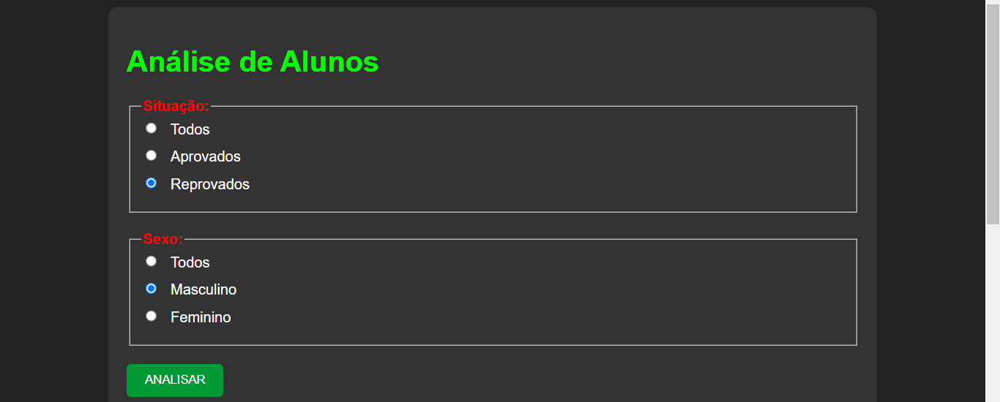
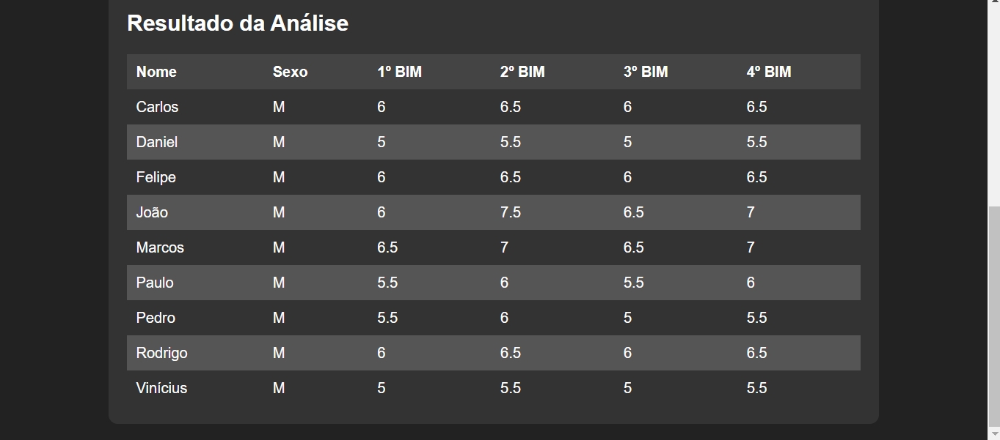
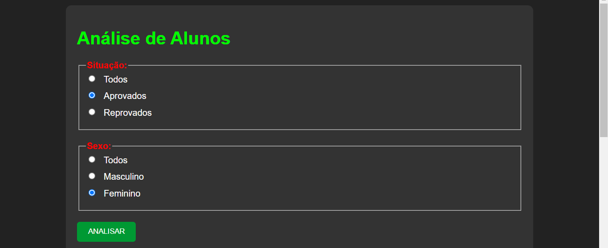
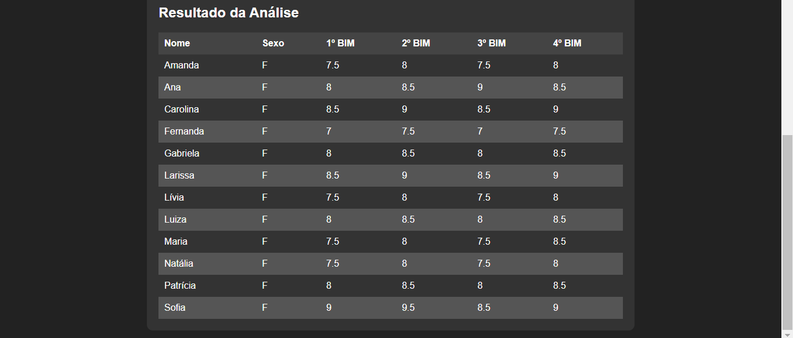

# ESCOLA COM POSTGRESQL
👨‍🏫FORMULARIO DE CONSULTA EM PHP, CSS E POSTGRESQL.

 <br>
 <br><br>
> Neste exemplo foi selecionado em "Situação -> Reprovados". E "Sexo -> Maculino".

 <br>
 <br>
> Neste exemplo foi selecionado em "Situação -> Aprovados". E "Sexo -> Feminino".

## DESCRIÇÃO:
Este aplicativo é uma ferramenta de análise de alunos de uma escola, desenvolvida com PHP e PostgreSQL. Atualmente, ele realiza apenas uma operação do CRUD, que é a operação de leitura (Read), permitindo aos usuários visualizarem informações sobre os alunos com base em critérios específicos.

Os usuários podem filtrar os alunos com base em duas categorias principais: situação acadêmica (aprovados, reprovados ou todos) e sexo (masculino, feminino ou todos). Após selecionar esses critérios e clicar no botão "ANALISAR", o aplicativo exibe uma tabela contendo os nomes dos alunos, seus respectivos sexos e as notas de cada bimestre.

É importante ressaltar que este aplicativo atualmente não oferece funcionalidades completas de CRUD (Create, Read, Update, Delete). No entanto, os desenvolvedores têm a liberdade de expandir o aplicativo para incluir essas funcionalidades adicionais. Isso pode ser feito adicionando as operações de criação, atualização e exclusão de registros de alunos no banco de dados, permitindo uma gestão mais completa das informações escolares. (Eu deixo esse desafio com vocês. Faça um FORK desse projeto em mandem ver 😉).

## EXECUTANDO O PROJETO:
1. **Configuração do Banco de Dados:**
   - Antes de executar o site, é necessário importar o arquivo `DATABASE.sql`. Se não estiver familiarizado com o processo de importação, [confira este curso](https://github.com/VILHALVA/CURSO-DE-POSTGRESQL) para orientações detalhadas.

2. **Configuração do PHP:**
   - Abra o arquivo `index.php` e ajuste as configurações do banco de dados:

     ```php
     $host = "localhost";
     $user = "seu_usuario";
     $pass = "sua_senha";
     $dbname = "ESCOLA";
     ```

3. **Executando o Aplicativo:**
   - Coloque os arquivos em um servidor web compatível com PHP (por exemplo, XAMPP, WAMP, LAMP).
   - Acesse o formulário no navegador visitando `http://localhost/CODIGO/index.php`.

4. **Interagir com o Projeto:**
   - Após acessar o projeto pelo navegador, você verá a interface do aplicativo. Você pode selecionar diferentes opções de situação (aprovados, reprovados ou todos) e sexo (masculino, feminino ou todos) e clicar no botão "ANALISAR" para visualizar os dados dos alunos com base nos critérios selecionados.

## NÃO SABE?
- Entendemos que para manipular arquivos em `HTML`, `CSS` e outras linguagens relacionadas, é necessário possuir conhecimento nessas áreas. Para auxiliar nesse aprendizado, oferecemos cursos gratuitos disponíveis:
* [CURSO DE HTML E CSS](https://github.com/VILHALVA/CURSO-DE-HTML-E-CSS)
* [CURSO DE PHP](https://github.com/VILHALVA/CURSO-DE-PHP)
* [CURSO DE POSTGRESQL](https://github.com/VILHALVA/CURSO-DE-POSTGRESQL)
* [CONFIRA MAIS CURSOS](https://github.com/VILHALVA?tab=repositories&q=+topic:CURSO)

## CREDITOS:
- [PROJETO CRIADO PELO VILHALVA](https://github.com/VILHALVA)


